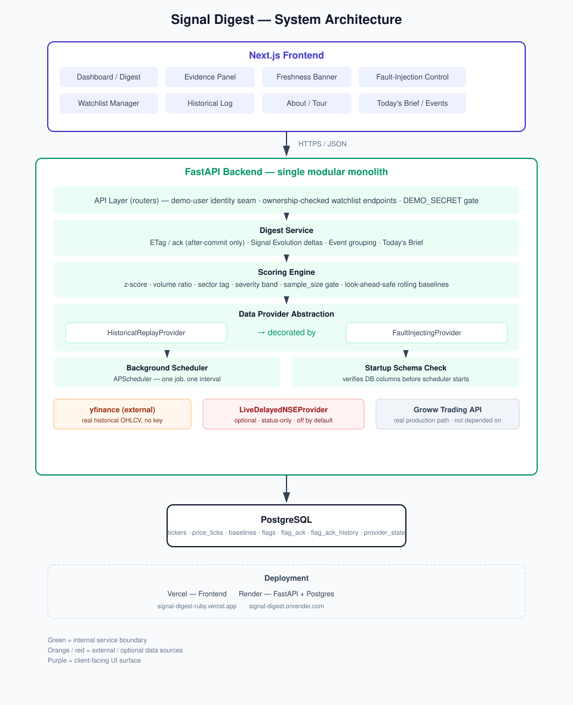
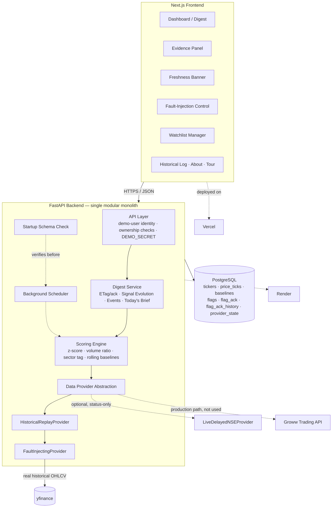

<div align="center">

# 📊 Signal Digest

**A watchlist that flags what's actually unusual — for *that specific stock* — not what always jitters.**

[](https://signal-digest-ruby.vercel.app/)
[](https://signal-digest.onrender.com/health)

[](#-testing)
[](#-testing)
[](#-testing)
[](#e2e-demo-rehearsal-playwright)
[](#5-the-meaningful-change-algorithm)

</div>

---
## 100-word product pitch

Signal Digest tells investors what actually deserves their attention—not just what moved. Instead of applying arbitrary percentage thresholds, it compares every stock’s price movement against its own rolling 30-day behavior, identifying statistically unusual moves with deterministic z-scores. Volume and sector context explain why each signal matters without hiding the logic behind an AI score. The product remembers what users have already seen: acknowledged signals automatically resurface when they materially worsen, showing exactly how they evolved. Built as a transactional modular monolith with explicit freshness states and live fault injection, Signal Digest prioritizes correctness and resilience. Real NSE historical data is replayed transparently to simulate live markets.

## 📑 Table of Contents

1. [Problem](#1-problem)
2. [Product Thesis](#2-product-thesis)
3. [Key Insight](#3-key-insight)
4. [Architecture](#4-architecture)
5. [The Meaningful-Change Algorithm](#5-the-meaningful-change-algorithm)
6. [Data Model](#6-data-model)
7. [Since-You-Last-Checked / Reliability](#7-since-you-last-checked--reliability)
8. [Trade-offs](#8-trade-offs)
9. [Scalability](#9-scalability)
10. [Setup](#10-setup)
11. [Testing](#11-testing)
12. [Known Limitations](#12-known-limitations)
13. [Future Improvements](#13-future-improvements)
14. [Tech Stack](#-tech-stack)

---

## 1. Problem

The obvious reading of "smart watchlist" is a price ticker with a search box and maybe a percent-change column. That's what Groww's watchlist already does, and it has a real failure mode: every row is rendered with equal visual weight, and every move is judged against the same flat threshold regardless of what's normal for that instrument. A 2% move in a historically stable FMCG stock and a 2% move in a volatile mid-cap Auto name are not the same event — a flat-threshold watchlist can't tell them apart, so it either floods you with noise or misses the thing that actually matters. The brief's own framing is exact: don't build the obvious watchlist, build the version you believe should exist, and be ready to explain why.

## 2. Product Thesis

Groww's real watchlist answers "what's the price now." Signal Digest answers **"does this deserve your attention, and why"** — by comparing every move to that instrument's own normal behavior instead of a one-size-fits-all threshold.

> **Core user promise:** Open your watchlist and know in five seconds what actually changed — not what always jitters — and why.

## 3. Key Insight

Meaningful change is relative to an instrument's own normal behavior, not an absolute number. A z-score crossing does that arithmetic once per ticker, per day, against that ticker's own rolling baseline. The explanation — *"2.9σ above normal, on 2.3× typical volume, moving independently of its sector"* — **is the product**; the ranked list is a side effect of having a real, comparable number to sort by, not the other way around.

## 4. Architecture



<details>
<summary>Or view as a live Mermaid diagram (renders directly on GitHub)</summary>



</details>

**Why a modular monolith, not microservices.** This is a direct, deliberate response to the Ghost ETag precedent (Groww's own postmortem — see [§7](#7-since-you-last-checked--reliability)): the bug that shipped was a *transaction-boundary* problem — a cache invalidation that fired before its write had committed, across a boundary that made "before" and "after" ambiguous. Splitting this system into services (a scoring service, a digest service, a notification service) reintroduces exactly that boundary — the ack-bust-in-the-same-transaction guarantee this project treats as its single most important correctness rule ([§6](#6-data-model)) cannot be a cross-service invariant without a distributed transaction or a saga, both of which are the wrong tool for a system this size. One process, one database, one transaction boundary was the actual engineering call, not a shortcut.

**Data provider abstraction.** `MarketDataProvider` is a two-method protocol (`get_ticks`, `get_status`). `HistoricalReplayProvider` is the only real implementation: it replays real historical closes chronologically via an explicit, injectable `ReplayClock` (not wall-clock-driven, so it's deterministic and testable), with its position persisted across restarts (see [§7](#7-since-you-last-checked--reliability)). `FaultInjectingProvider` wraps it as a **decorator, not a fork** — `outage`/`stale`/`recover` change what the same `get_ticks()`/`get_status()` calls return, so a live demo kill-switch exercises the identical code path a real provider outage would hit, not a special demo branch.

**yfinance vs. Groww's real Trading API.** Groww's real API (`growwapi`) exists and is the honest production integration path — but it requires an active F&O-enabled account and a subscription, which wasn't viable to depend on for this build. `yfinance` pulls real historical OHLCV for the fixed NSE universe with no key required; that real history is replayed/perturbed on a clock tick to simulate live ticks. This is disclosed simulation over **real underlying data** — deliberately not synthetic/random price generation, because the entire scoring engine's credibility depends on the numbers being real.

**Optional second provider — `LiveDelayedNSEProvider`, opt-in, off by default.** There's no legitimate free live NSE feed (Zerodha's Kite Connect needs a KYC'd trading account + static IP; unofficial NSE scrapers are undocumented and unreliable). This provider exists to prove the `MarketDataProvider` abstraction generalizes to a genuinely unreliable real source, not to solve that unsolvable problem — see `PRODUCT.md`'s "Data source" section for the full writeup. Gated behind `LIVE_PROVIDER_ENABLED=false`, orthogonal to `DEMO_MODE`, never wired into scoring — status-only via `GET /provider/live-status`.

## 5. The Meaningful-Change Algorithm

- **Primary trigger:** price z-score, `(today_return − mean_return_30d) / stdev_return_30d`, crossing `|z| ≥ 2.0`. Severity bands: `notable` (2.0–2.5), `significant` (2.5–3.5), `extreme` (≥3.5).
- **Annotations, never folded into the trigger:** volume ratio (`today_volume / avg_volume_30d`, `None`/"unknown" rather than a fabricated `0x` on a missing tick) and sector-relative context (`sector_wide` vs. `stock_specific`, `NULL` when fewer than 2 other sector members have a valid tick that cycle). Both are annotations on the z-score-driven flag, never averaged or weighted into one composite score.
- **Confidence gate:** `baselines.sample_size < 20` suppresses a flag entirely rather than emitting a confident-looking number off a handful of days of history.
- **One flag per ticker in the digest.** `GET /digest` surfaces only each ticker's single most-severe currently-unacknowledged flag (tie-broken by `|z_score|`, then most recent day). Older flags aren't deleted; they're queryable via `GET /tickers/{ticker}/flags` — the historical audit trail ([§11](#11-testing)).
- **Signal Evolution — "since you last checked," made literal.** Acknowledging a flag snapshots its severity/z-score (`flag_ack.severity_rank_at_ack`/`z_score_at_ack`). If it later escalates and the ack gets busted ([§6](#6-data-model)), the snapshot survives into `flag_ack_history` instead of being lost. `GET /digest` includes a `since_last_ack` field on any resurfaced flag with real prior history — e.g. *"2.7σ → 4.6σ, HIGH → EXTREME"* — `null`, never fabricated, if none exists.
- **Event grouping.** A pure, read-time aggregation over the digest's own already-returned rows: `sector_wide` flags sharing a sector are grouped into a collapsed "N stocks moving together" card once 2 or more genuinely cluster that cycle. No new table, no persistence — expanding a card just re-renders the same per-flag rows.
- **`volatility_regime` is computed and stored but not surfaced in the digest** — a real secondary signal (`stdev_5d`/`stdev_30d` crossing 1.5) originally hidden because static baselines made it repetitive noise. That's resolved (baselines now roll forward per trading day, [§8](#8-trade-offs)), but it stays hidden anyway because the digest's ranking and Today's Brief both assume a real z-score, which this signal type doesn't have. See `PRODUCT.md`.
- **"Today's Brief"** — a short, fully deterministic synthesis of the current unacknowledged signals, added as a `brief` field on `GET /digest`'s existing response. Pure aggregation plus fixed string templates — no LLM, no network call, nothing external that can fail. `null` with zero active signals.

## 6. Data Model

- **`price_ticks`** — immutable source of truth; needed to recompute anything after a fault-recovery.
- **`baselines`** — precomputed ahead of scoring. One row per `(ticker, as_of_date)`, rolled forward once per scheduler cycle from only the days strictly *before* the day being scored (look-ahead-safe).
- **`flags`** — durable record of *why* something was surfaced; backs the evidence endpoint and the uniqueness constraint that prevents duplicate flags.
- **`flag_ack`** / **`watchlist_ack_state`** — the aggregate hash is a cheap ETag-style short-circuit; the per-flag table is the fine-grained truth for "which specific things are new." `flag_ack` also carries `severity_rank_at_ack`/`z_score_at_ack` for Signal Evolution.
- **`flag_ack_history`** — audit-only. When an escalation busts an ack, the about-to-be-deleted `flag_ack` row is copied here first, in the same transaction, immediately before the delete.
- **`provider_state`** — fault-injection mode/timestamps and the replay clock's persisted position (`replay_step`, [§7](#7-since-you-last-checked--reliability)).

### Severity escalation busts the ack — the project's single most defensible correctness decision

`flags` upserts on `(ticker, trading_day, signal_type)`; `flag_ack` keys on the constant `flag_id`. Without a deliberate fix, a flag that escalates from `notable` to `extreme` intraday would stay silently acked even though it's a genuinely new qualifying event. The fix: read the previous `severity_rank`, upsert the flag's evidence unconditionally, copy the current `flag_ack` row into `flag_ack_history`, and — in the **same transaction** — delete the `flag_ack` row *if and only if* the new rank is strictly greater than the previous one.

This is deliberately **asymmetric**: escalation busts the ack; de-escalation does not. An ack means "the user has seen and dismissed this level of concern." Worse-than-dismissed is new information and must resurface. Better-than-dismissed has no new concern to raise.

## 7. Since-You-Last-Checked / Reliability

The digest's state machine is modeled explicitly on two real Groww engineering posts (tech.groww.in): the ETag-as-fingerprint-of-state pattern from their Holdings rendering work, and the Ghost ETag postmortem's lesson about invalidating cache only after a write has actually committed — both cited in full in `PRODUCT.md`.

**Live fault injection** (`POST /admin/fault {mode: outage|stale|recover}`, `DEMO_MODE`-gated, additionally gated behind an optional `DEMO_SECRET` on the public deployment so one visitor can't disrupt another's session) is a decorator over the real provider — killing the feed live triggers the same `STALE`/`UNAVAILABLE` state-machine logic a real outage would, not a scripted demo branch.

**Two real bugs found on the actual deployed instance — not in local testing:**

| Finding | What happened | Fix |
|---|---|---|
| Replay position reset on restart | `ReplayClock`'s position was process-memory only; a Render restart silently re-walked the replay from day one, pausing new scoring while `sample_size` re-climbed | Persist `replay_step` to `provider_state` every scheduler tick, restore on boot — verified via a real hard-kill, not a graceful stop |
| Corporate-action data artifact | Two tickers (`TRENT.NS`, `ITC.NS`) had a real, correctly-priced but non-organic price reset on one date (a demerger/bonus-issue pattern yfinance's split-tracking doesn't cover), producing implausible z-scores directly and by contaminating the following month's baseline windows | An explicit, documented `KNOWN_EXCLUSIONS` list drops the affected date from both baseline computation and flag generation — the raw `price_ticks` row is untouched |

**A startup schema-safety check** verifies every column/table added by a migration after the initial schema actually exists on the connected database before the app does anything else — built after the replay-step fix shipped to Render's code but the corresponding migration wasn't applied to Render's database, causing a crash loop. It turns an opaque `asyncpg.exceptions.UndefinedColumnError` into a one-line message naming the exact missing column and which migration file resolves it.

A few of the more interesting failure scenarios (full list of 14+ in `RELIABILITY.md`; the rest are Q&A material, not live narration): the Ghost-ETag-shaped recompute/ack race, IST timezone bucketing (a real gap found and fixed, [§11](#11-testing)), partial-ingestion idempotency, sector aggregation with missing members, and stale-ETag handling after days away.

## 8. Trade-offs

- **Deterministic scoring over ML/LLM.** An LLM-flavored watchlist is the generic 2026 move, not the differentiated one. The one narrow, optional LLM use case that was scoped out — phrasing per-flag explanations from already-computed structured signals — was never built; the deterministic template (and the fully deterministic Today's Brief, [§5](#5-the-meaningful-change-algorithm)) shipped instead.
- **Modular monolith over microservices** — see [§4](#4-architecture).
- **yfinance over Groww's live Trading API** — see [§4](#4-architecture).
- **Rolling, look-ahead-safe baselines — no longer a static simplification.** A baseline for trading day N is recomputed each cycle from only the days strictly before N, stored as a new `(ticker, as_of_date)` row — day N's own move never leaks into its own baseline.
- **Full-history baseline recompute every cycle, not incremental.** Simple and correct at this scale; a much larger universe or faster cadence would want running-sum maintenance instead.

## 9. Scalability

- The ETag short-circuit means a client with an unchanged view gets a `304` without the server ever running the unacked-flags join.
- Baselines are batch-computed ahead of time, not derived per-request.
- What would actually need to change for real scale: incremental baseline maintenance; a real live market data feed in place of the replay provider; a ticker universe that isn't fixed at 34 hand-curated names.

## 10. Setup

```bash
# 1. Postgres
docker compose up -d postgres

# 2. Schema — run every file in backend/migrations/ against the database, in numeric order.
#    (Check the directory for the current full list — the app's startup schema-check, §7,
#    will name exactly which one is missing with a one-line error if you skip one.)
for f in backend/migrations/*.sql; do
  docker compose exec -T postgres psql -U user -d signal_digest < "$f"
done

# 3. Backend
cd backend
python -m venv .venv && .venv/Scripts/activate   # or source .venv/bin/activate on macOS/Linux
pip install -r requirements.txt
cp ../.env.example .env   # fill in DATABASE_URL etc.

# 4. Historical data (one-off, real yfinance pull — takes a few minutes)
python -m scripts.seed_historical_data

# 5. Run the backend (scheduler starts automatically with the app)
uvicorn app.main:app --reload
# confirm: GET /health -> {"status":"ok"}

# 6. Frontend
cd ../frontend
npm install
npm run dev   # http://localhost:3000
```

`DEMO_MODE=true` gates `POST /admin/fault`; an optional `DEMO_SECRET` additionally requires a matching `X-Demo-Secret` header/query param, used on the public deployment so one visitor can't disrupt another's session — unset locally, no effect on local dev.

**Resetting to a clean slate:** `python -m scripts.reset_demo_state` truncates flag/ack state (including `flag_ack_history`) and resets `provider_state` to normal. It never touches `tickers`/`price_ticks`/`baselines` or `watchlists`/`watchlist_items`.

## 11. Testing

**192 backend tests** (pytest, real Postgres) + **72 frontend tests** (vitest) = **264 tests**, all passing — plus a real end-to-end Playwright test counted separately since it's a live-browser-against-live-backend tier, not an isolated unit.

- **The ack-bust escalation/de-escalation pair** — one test proves escalation busts the ack; a second, explicitly a "negative-space" test, proves de-escalation does not.
- **The `RETURNING`-behavior test** — asserts, against real Postgres, the exact row-count behavior that caught the original ack-bust upsert conflating "bust the ack" with "refresh the evidence," before it shipped.
- **The timezone boundary test** — a tick timestamped 19:30 UTC (01:00 IST the next day) must bucket into the correct IST trading day. Caught a real bug: `trading_day` was computed with `.date()` on a UTC-aware timestamp directly.
- **The look-ahead-safety test for rolling baselines** — seeds a violent move on the exact day being scored, asserts that day's own baseline shows no trace of it.
- **The Today's Brief state-tracking test** — asserts the brief's wording changes correctly as real flags are acked away, down to `null` once none remain.
- **The schema-check test suite** — reproduces the exact Render incident (migrations applied only through `003`) against a real throwaway database and asserts the app fails fast with a named missing column/migration.

### E2E Demo Rehearsal (Playwright)

`frontend/e2e/demo-rehearsal.spec.ts` walks the entire live demo script against a real backend, real Postgres, and real frontend — no mocks.

```bash
docker compose up -d postgres
cd frontend
npm run test:e2e
```

It resets demo state, fast-forwards real scoring, loads the dashboard, opens evidence, acknowledges a flag, triggers outage/recovery, finds a real not-yet-reached escalation candidate and seeds the precondition, waits for the live scheduler to naturally correct it, and asserts Today's Brief reflects the real post-escalation state — verified passing across multiple real runs, ~34s each.

## 12. Known Limitations

- `volatility_regime` is computed and stored but not surfaced in the digest — see [§5](#5-the-meaningful-change-algorithm).
- Rolling baselines recompute from full history every cycle, not incrementally.
- No separate walk-forward backtesting harness beyond replaying the live pipeline.
- `TATAMOTORS.NS` is absent — Yahoo Finance returned no data for this symbol during backfill; no fabricated substitute was inserted.
- Same-key severity escalation is architecturally deterministic under daily-close replay, not intraday ticks — a limitation of the replay model, not the ack-bust mechanism (verified correct independently). `backend/scripts/seed_demo_escalation_precondition.py` makes the mechanism demonstrable live within a 5-minute window by seeding one disclosed placeholder severity for a real, independently-pre-verified future day — stated here and in the script's own docstring, not presented as organic.

## 13. Future Improvements

- Incremental baseline maintenance if the universe or cadence scaled up.
- Re-surfacing `volatility_regime` once the digest ranking and Today's Brief handle a non-directional signal type.
- Real NSE trading-calendar/holiday gating.
- The optional LLM-explanation-phrasing layer — architecturally isolated, ready to slot in.
- Multi-watchlist support in the frontend (the data model already allows it).
- Real news/events signal integration.
- Feeding `LiveDelayedNSEProvider`'s data into scoring, if a genuinely reliable free/cheap live feed ever becomes viable.

---

## 🛠 Tech Stack

<div align="center">

**Frontend**


**Backend**


**Data & Testing**


**Infrastructure**


</div>

---

<div align="center">

Built for **Code, by Groww 2026** · [Live App](https://signal-digest-ruby.vercel.app/) · [API Health](https://signal-digest.onrender.com/health)
By Ananya Agrawal

</div>
